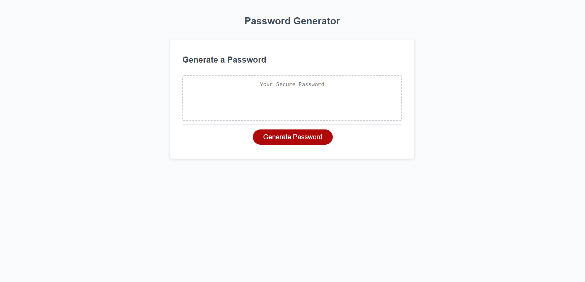

Deployed Site:
https://tonyavall.github.io/BC-HW-3/

Stack: HTML, CSS, Javascript

Logic Map:

Series of Prompts for Password Criteria
a. password length 8-128 (inclusive) characters
b. Confirm if includes CHAR TYPES: lowercase, uppercase, numeric, and/or special characters
    i. could use an object
    ii. could be separate strings
    c. input validation for each prompt and at least one char type should be selected 
    d. after prompts answer > password generates > in an alert or written to the page

Object Sketch:

let criteria = {
    letters:,
    numbers:,
    special_characters:,
}

letters is initially all lowercase and use .toUpperCase and set it to variable lettersCaps

I could turn all keys to variables for readability.

essentially all a giant if statement function that 
1. window.prompt(""); user inputs a value 8-128. checks if number is between 8-128.
    a. https://stackoverflow.com/questions/17907455/how-to-get-numeric-value-from-a-prompt-box
     b. parseFloat(prompt()); turns string value from prompt to an integer
2. declare user input as a variable
    a. i probably need a separate function for this that parseFloats, declares user input as a variable, and returns that variable value
3. the big function will contain the 8-128 validity?
4. idk where im going to put this function or if its part of the big function...
    a. a function that concats all accepted criteria strings, randomizes it using math(), and x number of characters is returned
